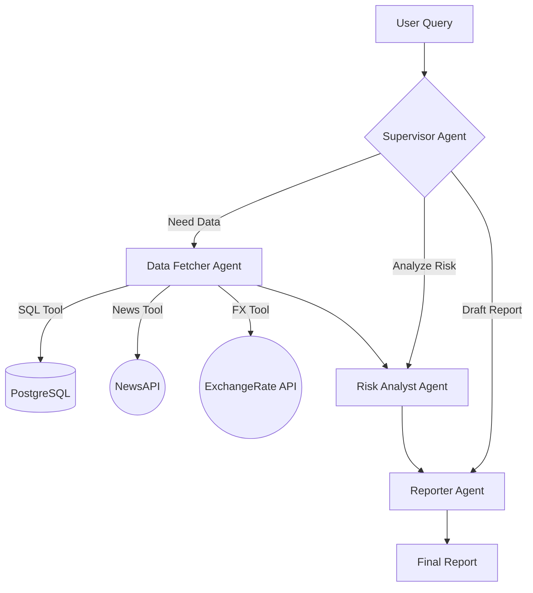

# 🛡️ Supply Chain Risk Sentinel

**An Agentic AI System for Real-Time Supply Chain Risk Monitoring & Analysis**


## 🚀 Overview

Supply Chain Risk Sentinel is a cutting-edge **Agentic AI application** designed to monitor, analyze, and visualize global supply chain risks in real-time. Built with **LangGraph**, it orchestrates a team of specialized AI agents (Supervisor, Data Fetcher, Risk Analyst, Reporter) to autonomously gather intelligence from SQL databases, live news APIs, and financial markets.

The system features a **"Control Room" style dashboard** that provides instant visibility into high-risk suppliers, regional disruptions, and financial trends, enabling proactive decision-making.

## ✨ Key Features

*   **🤖 Multi-Agent Architecture**: Powered by **LangGraph**, utilizing a Supervisor-Worker pattern to route tasks dynamically.
*   **🧠 Intelligent Risk Analysis**: A specialized **Risk Analyst Agent** correlates structured data (suppliers, shipments) with unstructured data (news, geopolitical events) to calculate real-time risk scores.
*   **📊 Live Control Room Dashboard**: A premium, dark-mode UI built with **Next.js** featuring:
    *   Real-time Risk Gauge with pulsing alerts.
    *   Interactive, glassmorphism-styled supplier cards.
    *   Automatic background scanning of monitored regions.
*   **🔍 Vector Search Integration**: Uses **Qdrant** for semantic search over supplier contracts and unstructured documents.
*   **🌐 Real-World Data Tools**: Integrated with **NewsAPI** and **ExchangeRate-API** for live external data fetching.

## 🛠️ Tech Stack

*   **AI Orchestration**: [LangChain](https://www.langchain.com/) & [LangGraph](https://langchain-ai.github.io/langgraph/)
*   **LLM**: Google Gemini Pro & Flash
*   **Backend**: FastAPI (Python)
*   **Frontend**: Next.js 14, Tailwind CSS, Lucide React
*   **Database**: PostgreSQL (Structured Data), Qdrant (Vector Data)
*   **Infrastructure**: Docker & Docker Compose

## 🏗️ Architecture



## 🚀 Getting Started

### Prerequisites

*   Docker & Docker Compose
*   Python 3.11+
*   Node.js 18+
*   API Keys for Google Gemini, NewsAPI, and ExchangeRate-API

### Installation

1.  **Clone the repository**
    ```bash
    git clone https://github.com/yourusername/supply-chain-risk-sentinel.git
    cd supply-chain-risk-sentinel
    ```

2.  **Set up Environment Variables**
    Create a `.env` file in the root directory:
    ```env
    GOOGLE_API_KEY=your_gemini_key
    NEWS_API_KEY=your_news_key
    EXCHANGE_RATE_API_KEY=your_fx_key
    POSTGRES_USER=postgres
    POSTGRES_PASSWORD=postgres
    POSTGRES_DB=supply_chain
    POSTGRES_HOST=localhost
    POSTGRES_PORT=5433
    QDRANT_URL=http://localhost:6333
    ```

3.  **Start Infrastructure (DB & Vector Store)**
    ```bash
    docker-compose up -d
    ```

4.  **Initialize Data**
    ```bash
    # Create virtual environment
    python -m venv .venv
    source .venv/bin/activate
    pip install -r requirements.txt
    
    # Seed database
    python scripts/setup_db.py
    python scripts/ingest_data.py
    ```

5.  **Run the Backend**
    ```bash
    uvicorn src.main:app --host 0.0.0.0 --port 8000 --reload
    ```

6.  **Run the Frontend**
    ```bash
    cd frontend
    npm install
    npm run dev
    ```

7.  **Access the Dashboard**
    Open [http://localhost:3000](http://localhost:3000) in your browser.

## 📸 Screenshots

*(Add your screenshots here)*

## 📄 License

MIT
